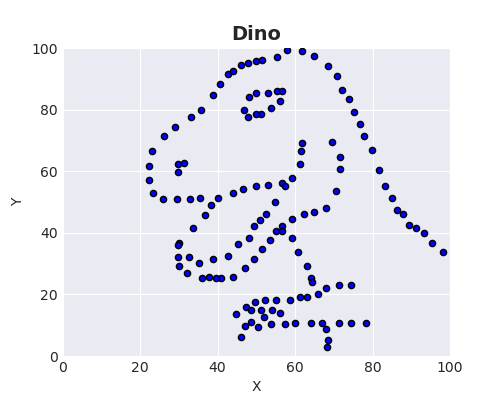
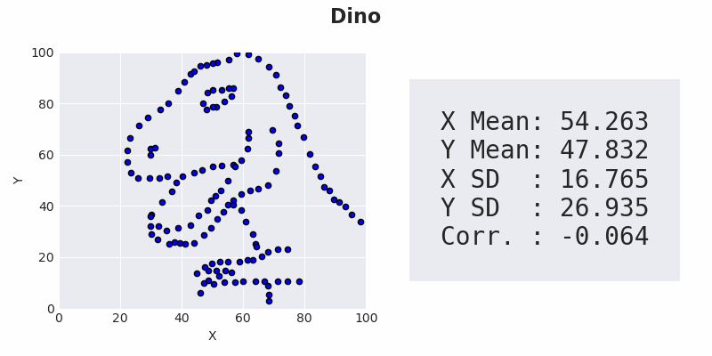

# Importance of Data Visualization

## Objective

In data exploration, the importance of graphical representations is often emphasized through datasets that exhibit similar statistical characteristics but produce different graphs.

In this project, we will present three well-known and illustrative examples:

- Anscombe’s Quartet
- Datasaurus
- Datasaurus Dozen

These examples underscore the need to not rely solely on summary statistics and demonstrate the crucial role of data visualization tools in ensuring accurate data analysis.

## Anscombe’s Quartet

Francis Anscombe formulated the Anscombe's Quartet in 1973, consisting of four distinct datasets. His aim was to challenge the prevailing belief among statisticians that numerical calculations are precise while graphs are only approximate, as he articulated in his writings.

These datasets highlight the importance of visualizing data in analysis and demonstrate how outliers and other influential observations can impact statistical properties.

The Anscombe's Quartet is available on [this Wikipedia page](https://en.wikipedia.org/wiki/Anscombe%27s_quartet#Data):

 

By applying the data transformations outlined in the notebook, we generated our dataframe (displaying first 4 out of the 11 rows):

 

###  Summary Statistics

Before creating scatter plots, we used matplotlib to display the summary statistics for each dataset.

 

After examining basic summary statistics, it becomes evident that all four datasets are identical. Each dataset shares the same summary statistics (X/Y mean, X/Y standard deviation, and Pearson’s correlation) up to the second decimal point.

Therefore, according to the standard convention, we would expect significant similarities among these datasets. 

### Scatter Plots with Linear Regression Line

We used matplotlib to visually explore the datasets. Alongside generating scatter plots for each dataset, we added a linear regression line and showed its corresponding equation.

 

Although the datasets have identical summary statistics and are intended to generate nearly identical linear regression lines, accurate to 2 decimal places for the intercept and 3 decimal places for the slope, their graphical representations exhibit clear and distinct differences.

This example highlights that descriptive statistics and numerical data alone may not offer a complete understanding of the data, emphasizing the significance of visual analysis.

## Datasaurus

The Datasaurus dataset was created by data visualization expert Alberto Cairo in 2016. This dataset consists of data points that have seemingly normal statistics. However, when plotted, these points reveal the unique shape of a dinosaur.

  

## Datasaurus Dozen

For decades, Anscombe's quartet has been a widely recognized and effective tool for emphasizing the importance of visualizing data. However, the origin of Anscombe's datasets remains unknown.

Justin Matejka and George Fitzmaurice introduced a versatile method for transforming any dataset into a target shape of choice while preserving specified summary statistics (up to two decimal places). Drawing inspiration from the Datasaurus dataset (*Dino*), they used it as the initial point to generate a set of diverse datasets, resulting in The Datasaurus Dozen.

The Datasaurus Dozen consists of 13 datasets, which include the original Datasaurus dataset along with 12 others, all sharing the same summary statistics.

 

### Exploring Datasaurus Dozen with Interactive Controls

Instead of plotting all datasets in a single figure, we want to plot each dataset with its own statistics in a separate figure. However, we aim to avoid creating a total of 13 cells to plot all datasets. To achieve this, we will use interactive IPython widgets.

We've positioned *Dino* at the beginning of the list to be plotted first after running the cell. Following that, we can utilize a dropdown menu to select any of the 13 datasets for plotting, without the need to rewrite or rerun the code.

 

### Datasaurus Dozen Animation

Utilizing interactive controls to display images, such as scatter plots and summary statistics, for selected datasets is quite impressive. However, to go through all 13 datasets, we had to manually choose each dataset from the dropdown menu.

To automate this process, we will use image animation. This animation will utilize the *`clear_output()`* and *`display()`* functions from the **IPython display** module.

We've created a *`dd_animate()`* function that loops through all datasets. In each iteration, it creates a scatter plot and displays the statistics. After a set time, both axes are cleared, along with the output of the cell, and the same process repeats until all datasets have been displayed. This gives the illusion of plot animation.

There's an option to save all plots as `.png` files for later GIF creation.

To play the animation, you will need to download the notebook and run the *`dd_animate()`* function after executing all the necessary cells.

If you prefer not to download the notebook, you can view the "animated images" in GIF format in the next chapter.

### Creating GIF

To create GIF animations, we'll use the Python library **imageio**, which offers a simple interface for managing various image formats.

We've generated two versions of the GIF:

- *DatasaurusDozen_0.gif* - loops indefinitely
- *DatasaurusDozen_2.gif* - repeats twice

 

## Tools /  Techniques Used

- Python
- JupyterLab
- pandas
- numpy
- matplotlib
- IPython.display
- ipywidgets
- imageio.v3

## References

- [Anscombe's Quartet](https://en.wikipedia.org/wiki/Anscombe%27s_quartet#Data)
- [Datasaurus](http://www.thefunctionalart.com/2016/08/download-datasaurus-never-trust-summary.html)
- [Same Stats, Different Graphs](https://www.research.autodesk.com/publications/same-stats-different-graphs/)
- [Jupyter Widgets - Using interact](https://ipywidgets.readthedocs.io/en/latest/examples/Using%20Interact.html)
- [IPython.display](https://ipython.readthedocs.io/en/stable/api/generated/IPython.display.html)
- [Create a GIF with Python](https://www.codedex.io/projects/create-a-gif-with-python)

## Acknowledgements

I'd like to express my gratitude to everyone who read the blog "Importance of Data Visualization" on my portfolio website and showed interest in this topic. Your support inspired me to create this repository and update the blog with additional information and visualizations.

## License

This project is licensed under the MIT License - see the [LICENSE](LICENSE) file for details.

